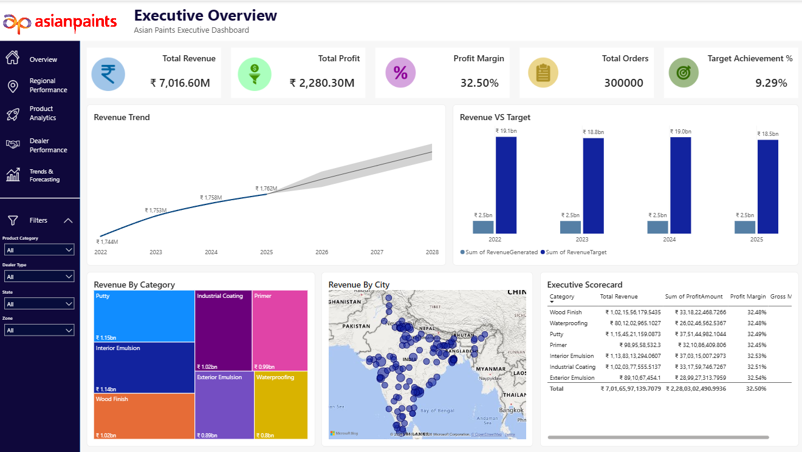
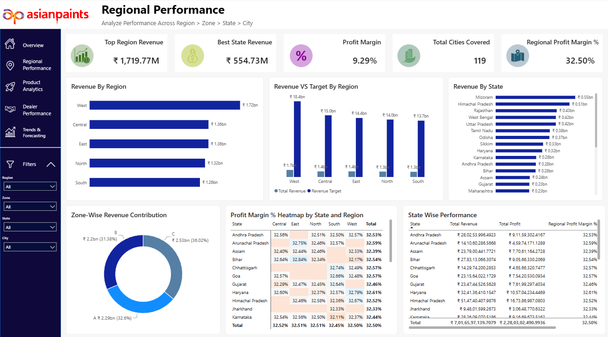
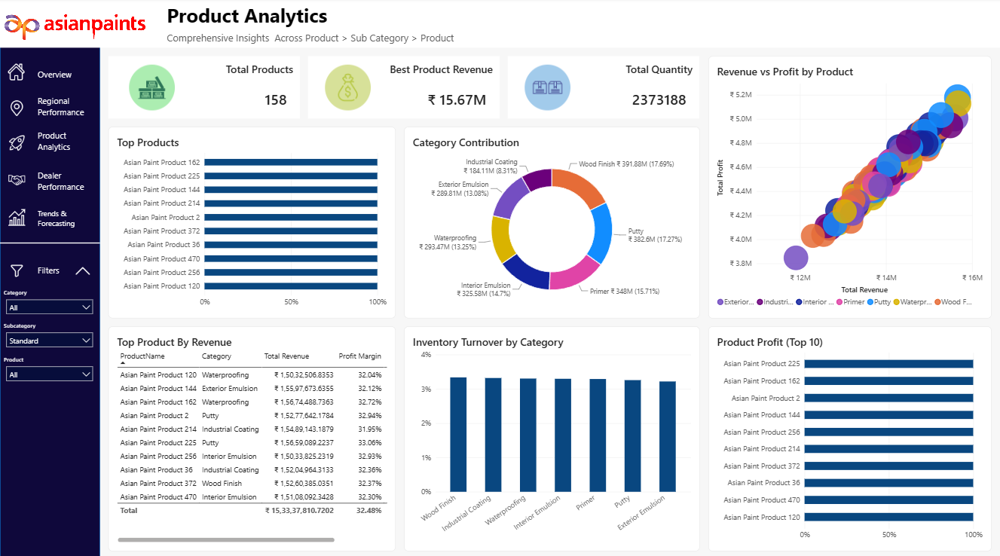
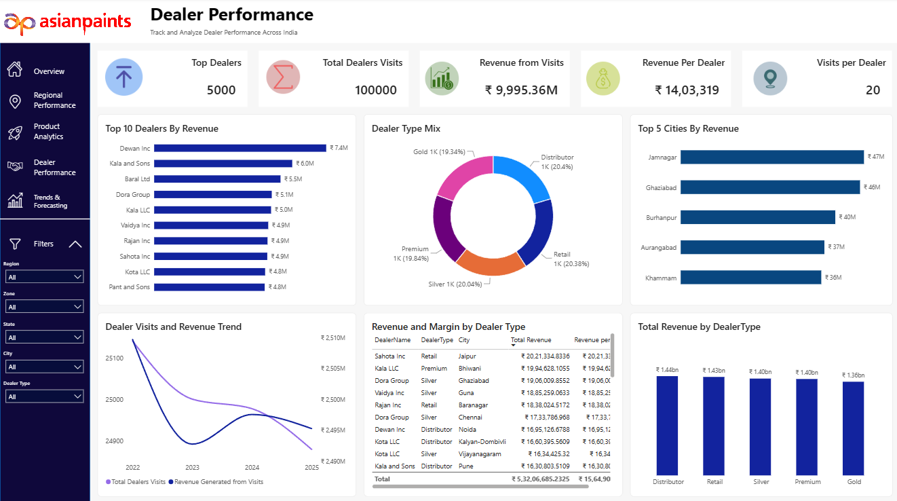
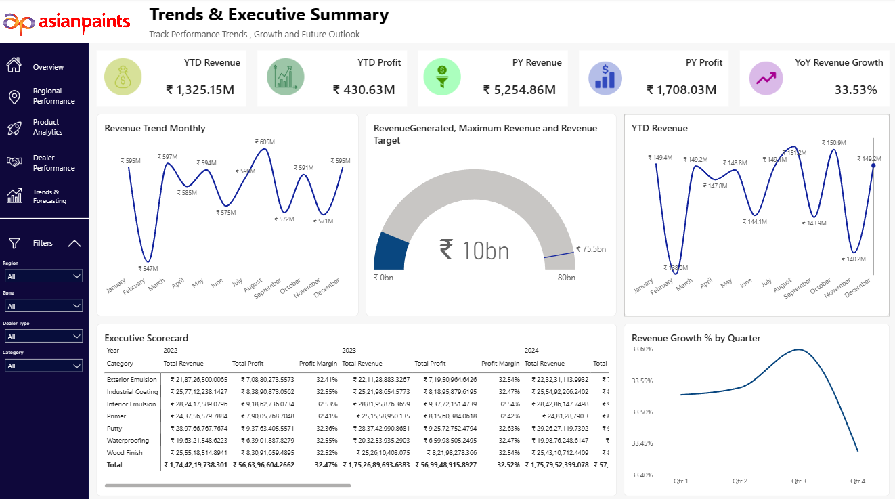

# 🎨 Asian Paints Executive BI Dashboard

<p align="center">
  
  
  
  
</p>

<p align="center">
  A 5-page enterprise-grade executive dashboard built in Power BI, covering ₹7,016.60M in revenue across 5 regions, 119 cities, 5,000 dealers, and 158 products — with forecasting, heatmaps, and drill-through navigation.
</p>

---

## 📌 Project Overview

| Attribute | Details |
|-----------|---------|
| **Tool** | Microsoft Power BI Desktop |
| **Domain** | Sales Analytics / Executive Reporting |
| **Company Simulated** | Asian Paints (India) |
| **Dataset Size** | Multi-dimensional, synthetic enterprise dataset |
| **Report Pages** | 5 (Overview → Regional → Product → Dealer → Trends) |
| **Total Revenue Tracked** | ₹7,016.60M |
| **Dealers Tracked** | 5,000 across India |
| **Cities Covered** | 119 |
| **Products Analyzed** | 158 across 7 categories |

---

## 📊 Dashboard Pages

### Page 1 — Executive Overview


The entry point for leadership. Displays the highest-level KPIs with cross-page navigation.

**KPIs:**
- Total Revenue: ₹7,016.60M
- Total Profit: ₹2,280.30M
- Profit Margin: 32.50%
- Total Orders: 300,000
- Target Achievement: 9.29%

**Visuals:**
- Revenue Trend line chart with forecast band (2022–2028)
- Revenue vs Target clustered bar chart by year
- Revenue by Category treemap (Putty ₹1.15bn, Interior Emulsion ₹1.14bn, Wood Finish ₹1.02bn, and more)
- Revenue by City — Bing Maps bubble chart (pan-India distribution)
- Executive Scorecard table — Category-level Revenue, Profit Amount, Profit Margin, and Gross Margin
- Slicers: Product Category, Dealer Type, State, Zone

---

### Page 2 — Regional Performance


Drills from Region → Zone → State → City for full geographic decomposition.

**KPIs:**
- Top Region Revenue: ₹1,719.77M (West)
- Best State Revenue: ₹554.73M
- Total Cities Covered: 119
- Regional Profit Margin: 32.50%

**Visuals:**
- Revenue by Region horizontal bar chart (West leads at ₹1.72bn)
- Revenue vs Target by Region — grouped bar chart
- Revenue by State — ranked horizontal bars (Mizoram to Maharashtra)
- Zone-Wise Revenue Contribution donut chart (Zone A: 32.6%, B: 31.38%, C: 36.02%)
- Profit Margin % Heatmap by State × Region (matrix with conditional formatting)
- State-Wise Performance table — Revenue, Profit, and Regional Profit Margin %
- Slicers: Region, Zone, State, City

---

### Page 3 — Product Analytics


SKU-level and category-level product intelligence with inventory insights.

**KPIs:**
- Total Products: 158
- Best Product Revenue: ₹15.67M
- Total Quantity Sold: 2,373,188

**Visuals:**
- Top Products ranked bar chart (Top 10 by % contribution)
- Category Contribution donut chart (Putty 17.27%, Primer 15.71%, Interior Emulsion 14.7%, Waterproofing 13.25%, Exterior Emulsion 13.08%, Industrial Coating 8.31%, Wood Finish 17.69%)
- Revenue vs Profit by Product — bubble/scatter chart (color-coded by category, positive linear correlation visible)
- Top Product By Revenue table — ProductName, Category, Total Revenue, Profit Margin
- Inventory Turnover by Category bar chart
- Product Profit (Top 10) — horizontal bar chart
- Slicers: Category, Subcategory, Product

---

### Page 4 — Dealer Performance


Tracks 5,000 dealers across India — visits, revenue, and dealer type mix.

**KPIs:**
- Total Dealers: 5,000
- Total Dealer Visits: 100,000
- Revenue from Visits: ₹9,995.36M
- Revenue Per Dealer: ₹14,03,319
- Visits Per Dealer: 20

**Visuals:**
- Top 10 Dealers by Revenue bar chart (Dewan Inc ₹7.4M → Pant and Sons ₹4.8M)
- Dealer Type Mix donut chart (Distributor 20.4%, Retail 20.38%, Silver 20.04%, Premium 19.84%, Gold 19.34%)
- Top 5 Cities by Revenue (Jamnagar ₹.47M, Ghaziabad ₹.46M, Burhanpur ₹.40M, Aurangabad ₹.37M, Khammam ₹.36M)
- Dealer Visits and Revenue Trend dual-axis line chart (2022–2025)
- Revenue and Margin by Dealer Type matrix table
- Total Revenue by Dealer Type clustered bar chart
- Slicers: Region, Zone, State, City, Dealer Type

---

### Page 5 — Trends & Executive Summary


Time-intelligence and growth analysis for strategic decision-making.

**KPIs:**
- YTD Revenue: ₹1,325.15M
- YTD Profit: ₹430.63M
- PY Revenue: ₹5,254.86M
- PY Profit: ₹1,708.03M
- YoY Revenue Growth: **33.53%**

**Visuals:**
- Revenue Trend Monthly — line chart showing seasonal oscillation (~₹547M–₹605M range)
- Revenue Generated vs Maximum Revenue vs Revenue Target — gauge chart (₹10bn actual vs ₹80bn target scale)
- YTD Revenue monthly line chart
- Executive Scorecard matrix — Category × Year (2022, 2023, 2024) showing Revenue, Profit, and Profit Margin
- Revenue Growth % by Quarter — line chart (peaks Q2/Q3, dips Q4)
- Slicers: Region, Zone, Dealer Type, Category

---

## 🗂️ Data Model

The report is built on a **star schema** with the following structure:

```
FactSales
├── DimDate         (Date hierarchy: Year → Quarter → Month)
├── DimProduct      (Category → Subcategory → Product)
├── DimDealer       (DealerType, DealerName, City)
├── DimGeography    (Region → Zone → State → City)
└── DimTarget       (RevenueTarget by Year and Category)
```

---

## 🗺️ Navigation Structure

The report uses a **custom side navigation panel** with icon-based buttons for page-level routing:

```
[Overview] → [Regional Performance] → [Product Analytics] → [Dealer Performance] → [Trends & Executive Summary]
```

Each page has slicers that persist context across visuals using Power BI's cross-filtering behavior.

---


## 🔑 Key Business Insights

- **West region dominates** with ₹1.72bn in revenue, 33% above the lowest-performing South (₹1.26bn)
- **Profit margin is remarkably stable** at ~32.5% across all 7 product categories — signals strong pricing discipline
- **Target achievement sits at only 9.29%** — the revenue target (₹80bn scale) is likely set for a multi-year horizon
- **Dewan Inc** is the single highest-revenue dealer at ₹7.4M, nearly 50% above the 10th-ranked dealer
- **YoY revenue growth of 33.53%** with Q2/Q3 seasonal peaks, consistent across years
- **Putty and Wood Finish** are the two largest categories by revenue contribution (≈17% each)

---

## 👤 Author

**Harshal Vora**
Data Science & BI Analyst

[](https://github.com/HarshalVora86)
[](https://www.linkedin.com/in/harshalvora86)

---

